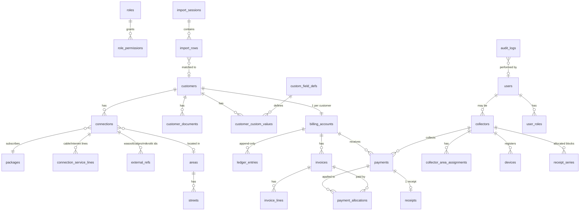

# ISP Billing & Collection System: Phase 0 Architecture

Status: **DRAFT for approval. No application code has been written.**

Inputs studied: `ISP_Billing_Collection_System_README.md`.
Not available in the workspace: the existing repository (none exists yet) and `Wasooli all conections.pdf`. Everything about PDF layout below is derived from the README's field list and is marked **[verify against PDF]** where a real sample is needed. See section 14 for the questions that block Phase 2.

---

## 1. Final Architecture

```text
Browser (Admin/Accounts)        Flutter app (Collectors, offline-first)
        │ HTTPS                          │ HTTPS (REST + sync)
        ▼                                ▼
                 Caddy (TLS, reverse proxy)
                          │
              ┌───────────┴───────────┐
              ▼                       ▼
        Next.js web              FastAPI backend ──► Redis (rate limit, queues, cache)
        (SSR/static)                  │   ▲
                                      │   └── Worker (RQ/Arq): PDF import, invoice runs,
                                      │       notifications, exports
                                      ▼
                    PostgreSQL            File storage (volume; S3-compatible later)
                                          uploads, import PDFs, CNIC docs, receipts

External, optional, never required for billing:
   MikroTik, Zalpro  ──►  accessed only through an `integrations` module behind an outbox
```

### Technology decisions

| Concern | Choice | Reason |
|---|---|---|
| Backend | **Python 3.12 + FastAPI**, SQLAlchemy 2, Alembic, Pydantic | Best PDF tooling (pdfplumber), native `Decimal`, you already work in Python for GenieACS/MikroTik/ZalPro. |
| Modular monolith | One backend deployable, strict internal modules | A single VM does not justify microservices. Modules keep integrations replaceable. |
| DB | PostgreSQL 16 | `NUMERIC`, constraints, partial indexes, `pg_trgm` for fuzzy matching, row-level audit triggers. |
| Jobs | Redis + Arq (or RQ) worker | PDF parsing and monthly invoice runs must not block requests. |
| Web | Next.js (React, TypeScript) | As specified. |
| Mobile | Flutter + `drift` (SQLite) | Offline store, and Flutter's text engine shapes Urdu correctly (used for printing, section 9). |
| Proxy | **Caddy** | Automatic HTTPS, simplest config for a single VM. |
| Auth | Short-lived JWT access token + rotating refresh token (hashed in DB), Argon2id passwords, TOTP 2FA for admin roles | |

### Backend module boundaries

`auth`, `rbac`, `customers`, `connections`, `packages`, `billing` (ledger, invoices, payments, receipts), `collections` (areas, routes, sync), `imports`, `accounting`, `reports`, `complaints`, `inventory`, `notifications`, `integrations`, `audit`, `settings`.

Rules: modules talk through service interfaces, never through each other's tables. `billing` has **no import** of `integrations`. This is how "billing works when MikroTik/Zalpro is down" is enforced structurally.

---

## 2. ERD



Key relationships worth stating in words:

- **customer 1 → N connections.** A connection carries the service (package, type, status, price override, billing day, external IDs).
- **Billing account is per customer, ledger lines are per connection.** A customer with two connections gets one statement and one balance, while each charge still traces to a connection.
- **Payments allocate to invoices** through `payment_allocations`. A payment can be partial, span invoices, or be unallocated (advance/credit).

---

## 3. Database Schema (Phase 1 target)

Conventions for every table: `id` UUID (v7) PK, `created_at`, `updated_at`, `created_by`; soft-delete (`deleted_at`) only on master data (customers, connections, packages, areas). **Financial tables are never soft-deleted or updated in place** (see billing). All money is `NUMERIC(12,2)`. Rates/percentages `NUMERIC(7,4)`. Timestamps are `timestamptz` stored UTC, displayed Asia/Karachi.

### Identity and access
- `users` (email/username unique, password_hash, totp_secret_enc, is_active, last_login_at)
- `roles` (code unique), `permissions` (code unique, e.g. `payment.create`, `customer.cnic.view`), `role_permissions`, `user_roles`
- `login_history` (user_id, ip, device, success, at)
- `refresh_tokens` (user_id, token_hash, device_id, expires_at, revoked_at)

### Customers and connections
- `customers`: `customer_code` unique (system-generated), `full_name`, `full_name_ur`, `father_name`, `cnic` (nullable, encrypted at column level), `mobile`, `mobile_normalized` (E.164, indexed), `whatsapp`, `alt_contact`, `address`, `address_ur`, `area_id`, `street_id`, `house_no`, `lat`, `lng`, `notes`, `photo_file_id`, `status` (ACTIVE/INACTIVE/ARCHIVED). **Only `full_name` is NOT NULL.**
- `custom_field_defs` (key, label, type, required, entity), `customer_custom_values` (customer_id, field_id, value jsonb): satisfies "admin can configure additional fields" without schema changes.
- `customer_documents` (customer_id, kind, file_id, sensitivity) with permission `customer.documents.view`.
- `packages`: `code` unique (internal ID), `name`, `display_name`, `display_name_ur`, `speed_mbps`, `monthly_price`, `cable_price`, `internet_price`, `status`, `description`. **No prices hardcoded anywhere.**
- `package_aliases` (package_id, alias text, source): maps PDF strings such as `Star3` → "Star 3". Unknown aliases surface in import review.
- `connections`: `customer_id`, `connection_code` unique, `internet_id`, `username`, `package_id`, `connection_type` (INTERNET/CABLE/COMBINED), `install_date`, `status` (ACTIVE/SUSPENDED/DISCONNECTED/FREE/TRIAL), `monthly_price_override`, `billing_day`, `area_id`, `notes`.
- `connection_service_lines` (connection_id, service CABLE/INTERNET, package_id nullable, price): supports combined cable + internet with separate amounts, as in the PDF columns.
- `external_refs` (connection_id, system `WASOOLI|ZALPRO|MIKROTIK`, ref_type `ID|INTERNET_ID|USERNAME`, value). Unique on `(system, ref_type, value)`. **This preserves ID and Internet ID** and is the primary matching key for re-imports.

### Billing (detailed in section 7)
- `billing_accounts` (customer_id unique, credit_balance_cache, status)
- `ledger_entries` (append-only), `invoices`, `invoice_lines`, `payments`, `payment_allocations`, `receipts`, `adjustments`, `refunds`, `billing_runs`, `charge_types` (INTERNET, CABLE, INSTALLATION, RECONNECTION, EQUIPMENT, LATE_FEE, OTHER, DISCOUNT)

### Collections
- `areas`, `streets`, `collectors` (user_id, status), `collector_area_assignments`, `collector_customer_assignments` (with `sort_order` for routes), `routes`, `route_stops`
- `devices` (collector_id, device_uid, label, registered_at, revoked_at)
- `receipt_series` (collector_id, device_id, prefix, range_start, range_end, next_value)
- `sync_batches` (device_id, received_at, item_count, result_summary)

### Import tracking (detailed in section 4)
- `import_sessions`, `import_rows`, `import_row_decisions`

### Audit
- `audit_logs` (user_id, action, entity, entity_id, before jsonb, after jsonb, ip, device, at). Insert-only; the app DB role has no `UPDATE/DELETE` on it.

### Later phases (schema reserved, not built in Phase 1)
`accounting_categories`, `expenses`, `complaints` and related, `inventory_*`, `notification_templates`/`notification_outbox`, `integration_outbox`, and fiber/OLT tables (`olt`, `pon_port`, `nap`, `splitter`, `onu` with a nullable FK to `connections`). The only Phase 1 commitment is that `connections` does not constrain these.

### Constraints worth calling out
- `CHECK (amount > 0)` on payments; `CHECK (amount <> 0)` on ledger entries.
- `UNIQUE (collector_id, client_txn_id)` on payments (idempotency).
- `UNIQUE (receipt_number)`.
- Partial unique index on `external_refs` as above.
- `pg_trgm` GIN indexes on `customers.full_name` and `address` for fuzzy search.
- Indexes on `mobile_normalized`, `connections.internet_id`, `connections.status`, `invoices(billing_account_id, status, due_date)`.

---

## 4. PDF Parsing Design

**Library:** `pdfplumber` (word-level coordinates) first, with `PyMuPDF` as a cross-check. Not plain text extraction, because multiline cells and `-` placeholders make line-based text parsing unreliable.

### Strategy: coordinate-based, header-anchored
1. For each page, locate the header row and derive **column x-bands** from the header word positions (Sno, ID, Internet ID, Name, Address, Install Date, Recharge Date, Mobile No, Install Amount, Other Amount, Package-Cable, Amount-Cable, Package-Internet, Amount-Internet, Total). Bands are recalculated per page, so slight drift is tolerated.
2. **Row anchoring:** a new logical row starts where the `Sno` band contains an integer. Words below that and before the next anchor belong to the same row, which handles multiline names and addresses.
3. **Page-boundary rows:** if the first lines of a page have no `Sno`, they are continuation lines of the last row of the previous page. If a row's anchor is the last line on a page and its trailing cells are empty, the next page's first lines are merged in. Any merge is flagged `merged_across_pages=true` and given lower confidence.
4. **Cell extraction:** assign each word to a column band by x-centre. Words straddling two bands go to a "suspect" bucket and lower the row confidence rather than being guessed.
5. **Sentinel handling:** `-`, empty, and whitespace become `NULL` in normalized values but remain verbatim in raw values.
6. Record, per row: `page`, `row_index`, `raw_text` (whole row), `raw_cells` (per-column strings), `bbox`.

### Normalization (pure functions, unit-testable)
| Field | Rule |
|---|---|
| Mobile | strip spaces/dashes, `03XXXXXXXXX` / `+923…` → E.164 `+923XXXXXXXXX`; invalid → warning, keep raw |
| Dates | try `dd/mm/yyyy`, `dd-mm-yyyy`, `dd-Mon-yy`; ambiguous → REVIEW **[verify format]** |
| Amounts | strip commas, parse as `Decimal`; non-numeric → ERROR for that field; `-` → NULL (not 0) |
| Package | lookup in `package_aliases` (case/space-insensitive); no match → `unmapped_package` flag |
| Name/address | collapse whitespace, preserve original casing; no auto "fixing" of spelling |
| Connection type | derived: cable fields only → CABLE; internet fields only → INTERNET; both → COMBINED; neither → REVIEW |
| Total | recompute `install + other + cable + internet`, compare with stated Total; mismatch → warning (never overwrite) |

### Disconnected customers
How the existing export marks disconnected rows (a column, a section heading, strike-through, zero amounts, or a separate page) is unknown **[verify against PDF]**. Design rule regardless: imported disconnected rows get `connection.status = DISCONNECTED` and **never** default to ACTIVE.

### Row confidence and status
Each row gets a confidence score from checks: Sno found, ID present, name present, band assignment clean, amounts parse, total reconciles, no cross-page merge, package mapped. Mapping to status:

- all checks pass → proceed to duplicate detection (NEW / DUPLICATE / UPDATED)
- soft failures (unmapped package, bad mobile, total mismatch, page merge) → **REVIEW**
- hard failures (no identifying data, unparseable amount) → **ERROR**
- **No row is ever dropped.** A final check asserts `rows_in_pdf == rows_in_import_session`. If the parser's row count disagrees with the PDF's Sno sequence (gaps or repeats), the session is flagged.

---

## 5. Import Workflow

```text
Upload ─► store file + SHA-256 ─► create import_session (UPLOADED)
   ─► worker: parse ─► normalize ─► validate        (PARSED)
   ─► duplicate detection / diff vs existing data    (MATCHED)
   ─► Preview UI: original vs normalized, per row    (IN_REVIEW)
   ─► admin decisions per row, bulk actions          (APPROVED)
   ─► import transaction                              (IMPORTING → COMPLETED)
   ─► import report (counts, errors, changes, skipped)
```

- `import_sessions`: file name, size, SHA-256, uploader, source system (`WASOOLI`), status, started/finished, summary counts, parser version, report file.
- `import_rows`: session_id, page, row_index, `raw_cells` jsonb, `normalized` jsonb, `status` (NEW/DUPLICATE/UPDATED/ERROR/REVIEW/IMPORTED/SKIPPED), `issues` jsonb (code, field, message, severity), `match_candidates` jsonb (customer_id, level, score), `confidence`, `row_hash`, `result_customer_id`, `result_connection_id`.
- `import_row_decisions`: row_id, decision (`IMPORT`, `SKIP`, `UPDATE_EXISTING`, `CREATE_SEPARATE`, `MANUAL_EDIT`), `edited_values` jsonb, decided_by, decided_at.
- **No row touches `customers`/`connections` until the session is approved.** The final import runs in one DB transaction per batch of rows, writing an audit entry per created/changed record.
- **Re-import safety:**
  - File SHA-256 already imported → warn "identical file previously imported" (still allowed, but all rows resolve to unchanged).
  - `row_hash` (hash of normalized values) compared to the stored last-imported hash on the matched connection: identical → **status stays unchanged and no write occurs**; differing → **UPDATED** with a field-level diff shown.
  - Customers present in the previous import but absent now are listed as "missing from this PDF" in the report and flagged for review, **never auto-disconnected**.
- Importing is idempotent: a crash mid-import resumes from rows not yet `IMPORTED`.

---

## 6. Duplicate Detection Algorithm

Evaluated in strict priority; the first level that yields a confident match decides the candidate, but lower levels still run to surface conflicts.

| Level | Key | Result |
|---|---|---|
| 1 | `external_refs` match on Internet ID | exact → candidate, confidence 1.0 |
| 2 | `external_refs` match on Wasooli/Zalpro ID | exact → candidate, 0.98 |
| 3 | normalized mobile number | candidate 0.8, but **shared mobiles are common** (family, one number across several connections), so this level never auto-matches alone |
| 4 | internet username | exact → 0.9 |
| 5 | fuzzy: `pg_trgm` similarity on name + address (+ same area) | 0.5–0.85 by score; below 0.5 ignored |

Decision rules:
- Level 1 or 2 exact match, **no conflicting data** → `UPDATED` or unchanged (existing customer).
- Level 1/2 match **but** name/mobile differ strongly → `REVIEW` (possible ID reuse or data entry error).
- Two different existing customers matched by different levels → `REVIEW` with both shown.
- Only level 3–5 matches → `DUPLICATE` (potential), shown for human decision. **Never merged automatically.**
- No matches → `NEW`.
- Within the same PDF: duplicate IDs or Internet IDs in two rows → both rows get `DUPLICATE` plus an in-file-duplicate issue.

All thresholds live in settings, not code constants.

---

## 7. Billing Architecture

### Principles
- **Append-only ledger.** `ledger_entries(billing_account_id, connection_id, entry_type, amount, currency, ref_type, ref_id, effective_date, posted_at, posted_by, reverses_entry_id)`. Charges are positive (customer owes), payments/credits negative. **Balance = SUM(ledger)**, never a hand-edited column. A cached balance may exist but is reconciled by a nightly check.
- **Nothing is edited or deleted.** A void or correction posts a *reversing* entry referencing the original. This satisfies "do not physically delete financial records".
- **Server-side only.** The API accepts `amount` for a payment but computes allocation, balance, and remaining due itself. Clients cannot send totals.
- **Transactions + row locks.** Every financial write runs in one DB transaction with `SELECT … FOR UPDATE` on the billing account to prevent race conditions between an online payment and a sync.
- **Money:** `Decimal` with explicit `ROUND_HALF_UP` to 2 dp at defined points (line level), never floats anywhere (including JSON: amounts serialized as strings).

### Monthly billing run
`billing_runs(period, status, started_by)` → for each eligible connection, generate an invoice with lines from `connection_service_lines` (cable, internet, combined), special pricing (`monthly_price_override`), discounts, and carried-forward balance shown as information (the balance itself lives in the ledger). Unique `(connection_id, period)` per recurring charge so a re-run cannot double-bill.
Eligibility by status: ACTIVE → billed; FREE/TRIAL → invoice at 0 (visible); SUSPENDED → configurable; DISCONNECTED → **not billed**.

### Payments
- `payments`: account, connection (nullable), amount, method (`CASH|COLLECTOR_CASH|BANK|JAZZCASH|EASYPAISA|CARD|QR`), collector_id, `client_txn_id`, `collected_at` (device time), `received_at` (server time), status (`POSTED|VOID|NEEDS_REVIEW`), receipt link.
- **Allocation policy** (configurable, default oldest-due-first): oldest invoice first, remainder becomes credit (advance). Partial payment leaves invoice `PARTIAL`.
- Invoice status is **derived** from allocations and due date: PAID, DUE, PARTIAL, OVERDUE; account/connection status adds SUSPENDED, DISCONNECTED, FREE.
- Refunds, adjustments, discounts and late fees are each their own ledger entry types, with reason and approver, and each permission-gated and audited.

### Payment gateway modularity
`PaymentProvider` interface (`initiate`, `verify`, `webhook`). Cash/collector is the first implementation. JazzCash/Easypaisa etc. later plug in without touching the ledger, since a confirmed provider payment simply calls the same `record_payment()` service.

### Integration decoupling
Payment posted → `integration_outbox` row (event `PAYMENT_RECEIVED`) written in the same transaction. A separate worker delivers to Zalpro/MikroTik when that phase exists; failure only retries the outbox row and never rolls back the payment.

---

## 8. Offline Synchronization Architecture

### On the device (SQLite via drift)
Tables: `customers_cache`, `bills_cache` (current invoice, previous balance, package), `pending_payments`, `local_receipts`, `sync_state`.

**Pre-departure sync:** `GET /sync/pull?since=<cursor>` returns the collector's assigned customers/bills as a delta (customers, connections, open invoices, balances, packages, receipt series allocation). Cursor is a server-side monotonic version, not a timestamp (clock-skew safe).

### Creating a payment offline
1. Generate `client_txn_id` (UUIDv4) and a **receipt number from the collector's pre-allocated block** (e.g. `RC-C07-004211`, where the server issued range 4200–4399 for that device). Offline numbers therefore never collide with other devices or the server.
2. Write `pending_payments` + `local_receipts` in one SQLite transaction (all-or-nothing).
3. Print the receipt (works fully offline, section 9).
4. The device shows balance **locally adjusted** and labelled "pending sync".

### Sync
`POST /sync/payments` (batch, idempotent):
- The server processes each item in its own transaction; response is a **per-item result** (`ACCEPTED`, `ALREADY_SYNCED`, `NEEDS_REVIEW`, `REJECTED` + reason), so a bad item never blocks the batch.
- `UNIQUE (collector_id, client_txn_id)`: replays return the original result (`ALREADY_SYNCED`), never a second payment. Safe to retry any number of times.
- Server validation: valid device and collector, customer assigned to the collector (or flagged), amount > 0, receipt number within issued range and unused.
- **Cash was physically handed over, so the server does not discard it.** If the customer's balance changed meanwhile (e.g. paid online or invoice voided), the payment is still recorded; any anomaly marks it `NEEDS_REVIEW` for an accountant rather than rejecting.
- Retry with exponential backoff; a payment stays in `pending_payments` until the server acknowledges it. UI shows a persistent unsynced count.
- Collectors have no delete/edit endpoints for payments. Local rows after server acknowledgment become read-only history. Corrections are requested as a void request reviewed by someone with `payment.void`.
- Receipt block exhaustion: the app refuses to take more offline payments when the block is nearly used up and warns early; the server issues a new block at the next sync.

### Required offline tests (Phase 4)
offline create, duplicate sync, partial-batch failure, retry after network drop, receipt before sync, receipt number block boundary, device clock skew.

---

## 9. Urdu Thermal Printing Architecture

**Never send Urdu as printer text.** Render to a bitmap and send as raster.

```text
Receipt model (data) ─► receipt template (configurable, per language)
   ─► Flutter canvas render: ParagraphBuilder with Noto Nastaliq Urdu
      (RTL, HarfBuzz shaping done by Flutter's text engine)
   ─► 1-bit bitmap at printer width: 384 dots (58 mm) or 576 dots (80 mm)
   ─► dithering/threshold ─► ESC/POS raster (GS v 0) in chunks
   ─► Bluetooth transport to printer
```

Decisions:
- **Rendering in the app (Flutter), not on the server**, because receipts must print fully offline.
- Font: bundle **Noto Nastaliq Urdu** (primary) with **Noto Sans Arabic** as a fallback for dense numeric/compact layouts. Nastaliq's tall line height is wasteful on 58 mm paper, so layout presets (compact/regular) are configurable.
- Digits: configurable Western (0-9) vs Eastern Arabic-Indic; default Western for amounts, to match what customers read in billing.
- Printing is a transport abstraction `PrinterTransport` (Bluetooth Classic SPP first, BLE second). Many cheap printers use Bluetooth Classic, which is Android-friendly; **iOS support is limited for Classic, so Android is the target platform for collectors**. Flagged as a decision.
- Template engine: JSON template (`logo, header, rows, qr, footer`) with placeholders; text strings (ISP name Urdu, footer, labels) editable in admin. Template and printer settings are fetched on sync and cached.
- QR code: encodes receipt number + verification URL/hash; rendered into the bitmap.
- Test-print: a fixed sample receipt that exercises Urdu shaping, digits, QR, and full paper width.
- Per-device remembered printer (MAC + width + density) stored in local settings.
- Reprint always regenerates from stored receipt data, adding a "COPY / دوبارہ" marker; the original is never altered.
- Risk: printer-specific density/speed quirks and chunk delays. Mitigation is a printer profile table (chunk size, delay) per model.

---

## 10. Security Model

### Authentication
Argon2id hashing; account lockout/backoff; refresh-token rotation with reuse detection; TOTP 2FA mandatory for Super Admin, Admin, Accountant; device registration for collectors (revocable, so a lost phone is cut off server-side); login history recorded.

### Authorization (server-side only)
Permission strings, checked by a dependency on every route. Roles are bundles of permissions; the client UI hides things for convenience but is never trusted.

| Role | Representative permissions |
|---|---|
| Super Admin | everything, including role/permission management |
| Admin | customers, packages, imports, settings, users (not role definitions) |
| Manager | read most, approve imports, view reports |
| Accountant | invoices, payments, voids, refunds, accounting, exports |
| Collector | `customer.view_assigned`, `payment.create`, `receipt.print`, `collection.view_own` |
| Technician | complaints, inventory (assigned) |
| NOC | read network/connection status |
| Sales | create customers/connections in scope |
| Dealer/Reseller | scoped to own customers (row-level scoping via `owner_id`) |

**Row-level scoping:** collectors see only assigned areas/customers, enforced in queries by the repository layer, not by the UI.

### Data protection
- CNIC: column-level encryption (app-layer, key from env/secret, rotatable) and masked by default; viewing the number or images needs `customer.cnic.view` and writes an audit entry. Documents stored outside the web root, served only through authorized signed URLs.
- TLS everywhere; HSTS; secure cookies for web (httpOnly, SameSite) or token in memory + refresh cookie.
- Rate limiting at Caddy and in app (Redis), stricter on auth and sync endpoints.
- Upload security: type sniffing, size limits, no execution, AV scan hook, random storage names, PDF parsed in the worker (isolated from the API process).
- Input validation via Pydantic; SQLAlchemy parameterized queries only; CSRF protection for cookie auth; CSP on web.
- Audit logs insert-only (DB permission), capturing before/after for sensitive changes.
- Secrets only in `.env`/Docker secrets; `.env.example` committed, `.env` gitignored.
- Backups encrypted (age/gpg), offsite copy, **scheduled restore test** (a failing restore test alerts).

---

## 11. Docker / Proxmox Deployment Architecture

```text
Proxmox host ─► Ubuntu Server LTS VM (e.g. 4 vCPU, 8 GB RAM, 100 GB SSD; ample for a small ISP)
   └─ Docker Compose
        ├─ caddy        (80/443, automatic TLS or internal CA on LAN)
        ├─ web          (Next.js)
        ├─ api          (FastAPI, uvicorn/gunicorn)
        ├─ worker       (Arq: imports, billing runs, notifications)
        ├─ postgres     (volume: pgdata)
        ├─ redis        (AOF persistence)
        └─ backup       (cron container: pg_dump + storage tar, encrypted, retention)
   Volumes: pgdata, storage, backups, caddy_data
```

- **HTTPS:** public domain → Let's Encrypt via Caddy; LAN-only → Caddy internal CA. Needs a decision (section 14).
- Compose: health checks on every service, `depends_on: condition: service_healthy`, resource limits, log rotation, restart policy `unless-stopped`.
- Migrations run as a one-shot `migrate` step before `api` starts (Alembic, reversible where practical).
- Scripts: `backup.sh` (pg_dump custom format + storage archive + config, encrypt, prune by retention 7 daily / 4 weekly / 12 monthly), `restore.sh` (into a scratch DB first, then promote), `update.sh` (backup, pull, migrate, restart, health verify, rollback instructions).
- Proxmox layer: VM snapshots before upgrades, plus Proxmox Backup Server/vzdump as a second, independent backup layer. Postgres dumps remain the primary logical backup.
- Observability hooks: structured JSON logs, `/health` and `/ready` endpoints, Prometheus metrics endpoint (optional), alert on failed backup/restore test and on sync error rate.

---

## 12. Repository Structure

As in the README, with these refinements:

```text
isp-billing-system/
├── README.md  docker-compose.yml  .env.example  .gitignore
├── docs/                 architecture.md database.md pdf-import.md billing.md
│                         mobile.md printing.md security.md deployment.md
├── backend/
│   ├── src/app/{auth,rbac,customers,connections,packages,billing,collections,
│   │            imports,accounting,reports,complaints,inventory,notifications,
│   │            integrations,audit,settings,core}/
│   ├── migrations/       (Alembic)
│   ├── tests/{unit,integration,import_fixtures}/
│   └── Dockerfile
├── web/                  Next.js (src/, Dockerfile)
├── mobile/               Flutter (lib/{data,domain,sync,printing,ui}, test/)
├── scripts/              backup.sh restore.sh update.sh
└── storage/.gitkeep
```
`backend/tests/import_fixtures/` holds a **sanitized** excerpt of the real PDF (names/mobiles masked), since the real file contains customer personal data and must not be committed to git.

---

## 13. Development Plan

Phases 1–16 follow the README order. Concrete notes per phase:

| Phase | Deliverable | Exit criteria |
|---|---|---|
| 1 | Schema + migrations, auth, RBAC, CRUD for customers/connections/packages, ledger/payment/receipt core, audit, import tracking tables | migrations up/down tested; permission tests; money tests; no importer/mobile/integration code |
| 2 | PDF importer end-to-end | all listed importer test cases pass against sanitized real-PDF fixtures; row-count invariant holds |
| 3 | Billing runs, invoices, allocation, adjustments | all billing test cases, rerun-safe |
| 4 | Flutter collector app + sync API | offline test suite passes |
| 5 | Bluetooth Urdu printing | verified on **real** 58 mm and 80 mm printers |
| 6–10 | Dashboard, accounting, reports, tickets, inventory | per README |
| 11–14 | Portal, MikroTik/Zalpro, notifications, maps | after core is stable |
| 15–16 | Security hardening, production deployment | full review, restore test passed |

Per phase, as the README requires: tests, migration check, security/permission check, docs, then **stop for approval**.

---

## 14. Risks, Technical Decisions, and Open Questions

### Risks
1. **PDF layout fidelity (highest).** The importer design is built from the README's field list, not from the actual file. Column order, date formats, how disconnected rows are marked, and how multiline cells wrap are all unverified. A real sample could change section 4.
2. **Shared/missing identifiers.** Mobile numbers can repeat across customers; some rows may lack ID. Mitigated by never auto-merging on weak keys.
3. **Urdu printing on cheap printers.** Raster density, speed, and Bluetooth chunking vary by model. Needs real hardware testing before Phase 5 sign-off.
4. **iOS vs Android for Bluetooth Classic printers.** Likely Android-only for collectors.
5. **Receipt-number blocks** add operational complexity but are what makes offline receipts safe.
6. **Real personal data in the PDF** (names, mobiles, addresses): must stay out of git, test fixtures must be masked.
7. **Single-VM deployment** is a single point of failure; mitigated by tested backups plus Proxmox snapshots, not by clustering.

### Decisions I am asking you to confirm
- Backend language: **Python/FastAPI** (recommended) vs Node/NestJS.
- Reverse proxy: **Caddy** (recommended) vs Nginx.
- Append-only **ledger** as the balance source of truth (recommended).
- Collectors on **Android** only for printing.
- Pre-allocated **receipt number blocks** per device.
- Receipt rendering in the **Flutter app** with Noto Nastaliq Urdu.

### Open questions (blocking Phase 2 unless noted)
1. Please provide `Wasooli all conections.pdf` (or a masked sample of ~2–3 pages including a disconnected customer, a cable-only row, and a page-break row).
2. How does the PDF indicate a **disconnected** customer?
3. What is the PDF's **date format** and are amounts in PKR whole rupees?
4. Is **Total** a reliable sum, or does it include arrears?
5. Is "Recharge Date" the next due date or the last payment date? (Affects billing day and initial balances.)
6. Does the PDF carry any **opening balance/arrears**? If not, initial balances start at zero. Confirm.
7. Public domain with Let's Encrypt, or LAN-only HTTPS? (Also decides whether collectors reach the server from outside the office.)
8. How many customers, collectors, and areas to expect? (Sizing only; the design handles thousands comfortably.)
9. Do any collectors use iPhones?

**No code has been written. Awaiting your approval (and answers to the blocking questions) before Phase 1.**
